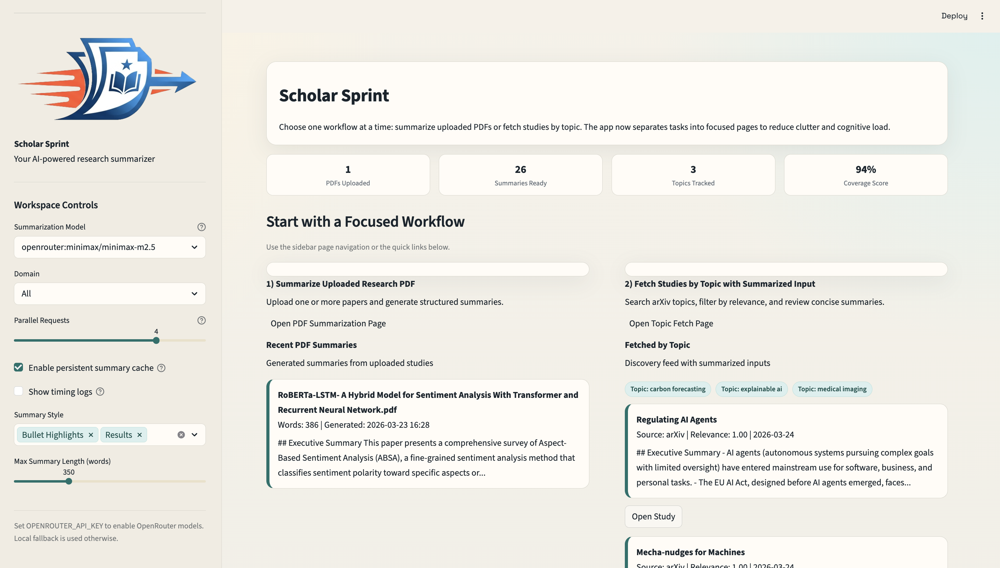
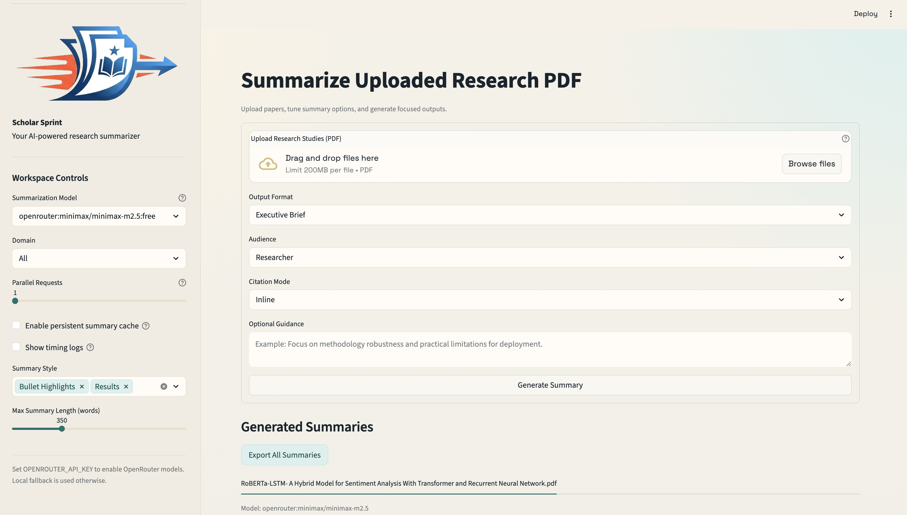
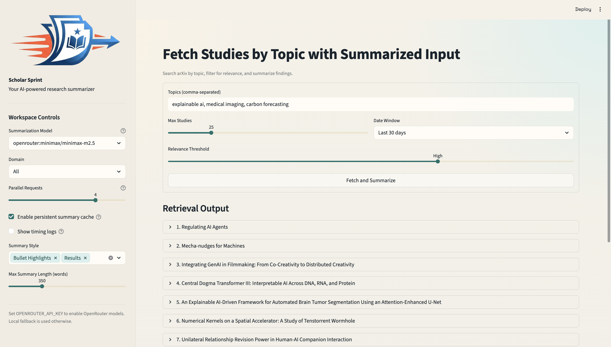
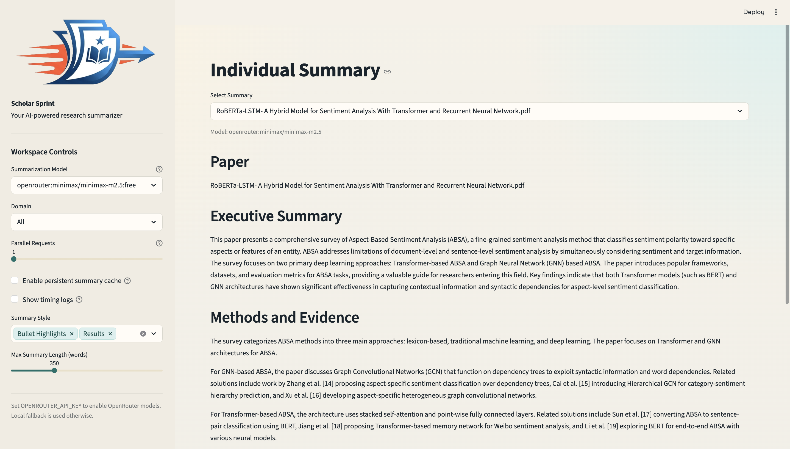

	
	<h1>Scholar Sprint</h1>
	

		<em>Accelerate your literature review with focused, AI-assisted research summaries.</em>
	

	

		<a href="#features">Features</a> •
		<a href="#feature-screenshots">Screenshots</a> •
		<a href="#run">Run Locally</a>
	

	
	
	

## Project Overview

ResearchSummarizer is an interactive Streamlit app for exploring research papers and generating structured summaries. It separates the experience into focused pages for two main workflows: uploading PDF papers and fetching papers by topic from arXiv.

The project solves the problem of manual, time-consuming paper review by giving users a single UI to collect studies, extract content, and produce concise summaries tailored to audience, length, style, and citation preferences.

## Features

- PDF upload summarization: Upload one or more PDF studies and generate structured summaries from extracted text.
- Topic-based paper discovery: Search arXiv by topic, preview returned studies, and summarize selected papers.
- Configurable summary output: Control summary length, output format, audience, citation mode, and writing style.
- LLM-powered summarization option: Use OpenRouter models through `pydantic-ai` for higher quality summaries.
- Local fallback summarization: Uses extractive summarization logic when LLM output is unavailable.
- Caching and reuse: Stores generated summaries in local cache files to reduce repeated work.
- Streamlit multipage UX: Dedicated pages for each workflow, plus an individual summary detail page.

## Feature Screenshots

### Landing Page

Overview dashboard with quick navigation and app summary.

### Summarize Uploaded Research PDF

Upload one or more PDF papers and generate structured summaries.

### Fetch Studies By Topic

Search and fetch relevant studies by topic, then summarize selected results.

### Individual Summary Detail

Review a focused, detailed summary view for an individual paper.

## Dependencies

- `streamlit`: Builds the web dashboard, UI controls, layout, and app runtime.
- `pypdf`: Reads uploaded PDF files and extracts document text for summarization.
- `pydantic-ai`: Creates and runs the LLM agent used to call OpenRouter models.
- `pydantic`: Provides core data validation/model utilities used by the `pydantic-ai` stack.

## Run

1. Create and sync environment:
	`uv sync`
2. Start the app:
	`uv run streamlit run app.py`

## Model Setup

1. Open OpenRouter: https://openrouter.ai/
2. Create an API key in your OpenRouter account.
3. Set your OpenRouter key locally:
	`export OPENROUTER_API_KEY="your_key_here"`
4. Choose model from the sidebar in the app.
5. Edit model list in `app.py` under `MODEL_OPTIONS` to add/remove models.

## Pages

- Home: Overview, KPI snapshot, and quick links to workflow pages.
- Summarize Uploaded Research PDF: Upload files and generate structured summaries.
- Fetch Studies by Topic with Summarized Input: Query arXiv topics and summarize results.
- Individual Summary: Focused detail view for one generated PDF summary.

## Scope

- UI-only dashboard for uploading PDF studies and previewing summary workflow
- UI-only dashboard for fetching studies by topic with summarized output preview
- No backend processing or retrieval logic implemented yet
