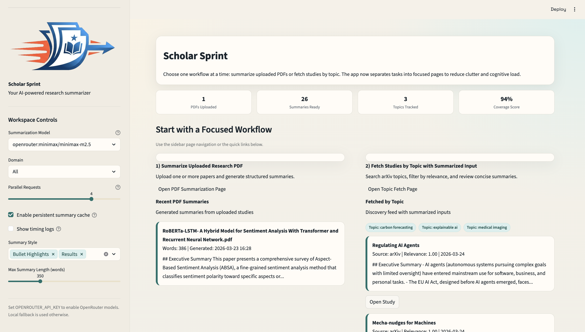
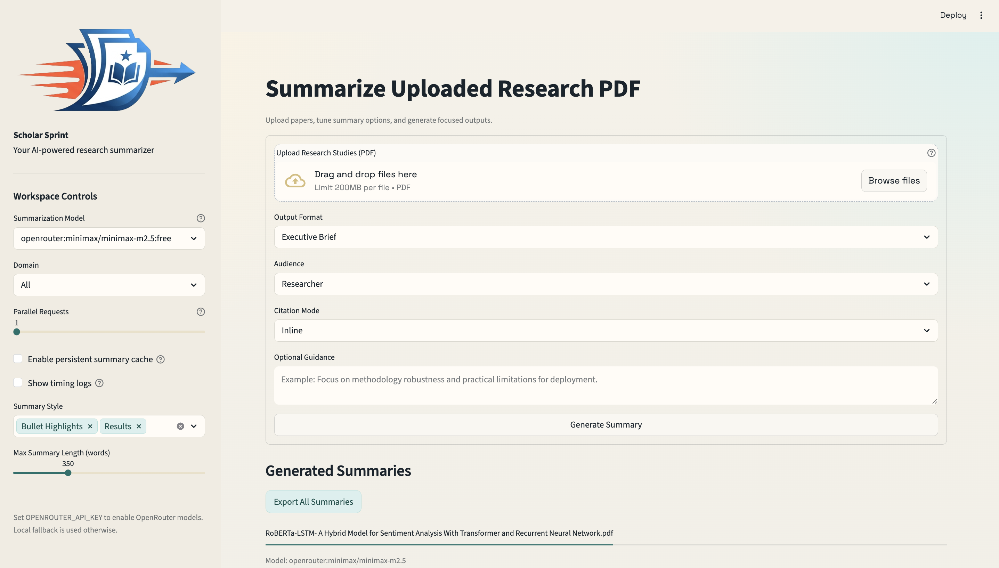
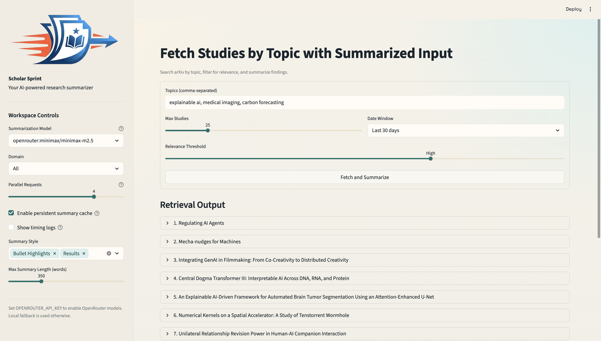
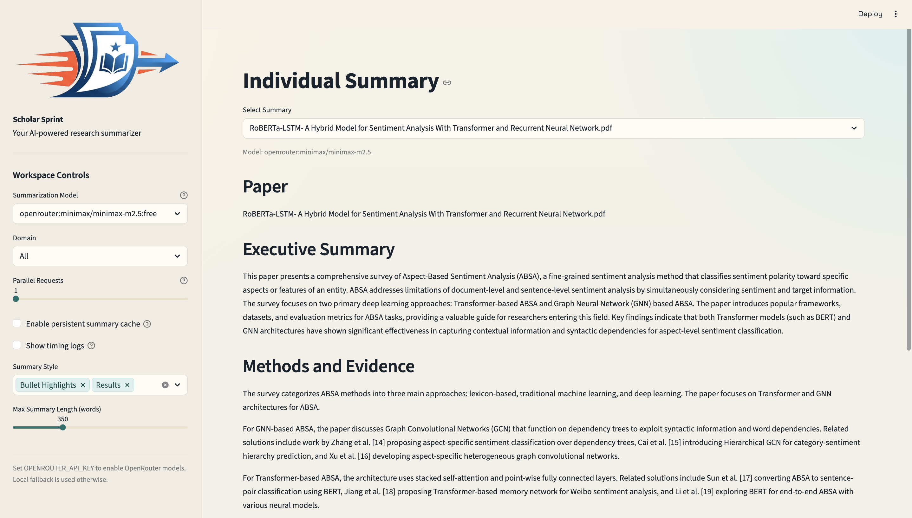

<div align="center">
	
	<h1>Scholar Sprint</h1>
	<p>
		<em>Accelerate your literature review with focused, AI-assisted research summaries.</em>
	</p>
	<p>
		<a href="#features">Features</a> •
		<a href="#feature-screenshots">Screenshots</a> •
		<a href="#run">Run Locally</a>
	</p>
</div>

<p align="center">
	
	
	
</p>

## Project Overview

Scholar Sprint is an interactive Streamlit app for exploring research papers and generating structured summaries. It separates the experience into focused pages for two main workflows: uploading PDF papers and fetching papers by topic from arXiv.

The project solves the problem of manual, time-consuming paper review by giving users a single UI to collect studies, extract content, and produce concise summaries tailored to audience, length, style, and citation preferences.

## Features

- PDF upload summarization: Upload one or more PDF studies and generate structured summaries from extracted text.
- Topic-based paper discovery: Search arXiv by topic, preview returned studies, and summarize selected papers.
- Configurable summary output: Control summary length, output format, audience, citation mode, and writing style.
- Multi-format export: Download any generated summary as Markdown, PDF, plain text, LaTeX, or Word (`.docx`).
- LLM-powered summarization option: Use OpenAI or OpenRouter models through `pydantic-ai` for higher quality summaries.
- Local fallback summarization: Uses extractive summarization logic when LLM output is unavailable.
- Caching and reuse: Stores generated summaries in local cache files to reduce repeated work.
- Streamlit multipage UX: Dedicated pages for each workflow, plus an individual summary detail page.

## Feature Screenshots

### Landing Page

Overview dashboard with quick navigation and app summary.



### Summarize Uploaded Research PDF

Upload one or more PDF papers and generate structured summaries.



### Fetch Studies By Topic

Search and fetch relevant studies by topic, then summarize selected results.



### Individual Summary Detail

Review a focused, detailed summary view for an individual paper.



## Dependencies

- `streamlit`: Builds the web dashboard, UI controls, layout, and app runtime.
- `pypdf`: Reads uploaded PDF files and extracts document text for summarization.
- `pydantic-ai`: Creates and runs the LLM agent used to call OpenAI and OpenRouter models.
- `pydantic`: Provides core data validation/model utilities used by the `pydantic-ai` stack.
- `fpdf2`: Renders summary exports to PDF (pure Python, no system TeX or browser needed).
- `python-docx`: Writes summary exports to Word `.docx` documents.

## Run

Requires [uv](https://docs.astral.sh/uv/getting-started/installation/). The project uses Python 3.11 via `.python-version`; uv downloads it if needed.

Run these commands from the repository root:

```sh
uv sync --locked
uv run streamlit run app.py
```

Open http://localhost:8501. Stop the app with `Ctrl+C`.

`uv sync --locked` installs the dependencies declared in `pyproject.toml` at the versions recorded in `uv.lock`, including `pypdf` and `pydantic-ai`, into the project's `.venv`. `requirements.txt` is maintained for pip-based installs; uv does not read it when syncing the project.

If uv warns that `VIRTUAL_ENV` points to another project, run `deactivate` in your terminal, then rerun the commands above. If `deactivate` is unavailable, use `unset VIRTUAL_ENV`. You do not need to activate `.venv` manually or use `--active`.

If an existing checkout reports `ModuleNotFoundError`, stop Streamlit, pull the latest changes, and run `uv sync --locked` before restarting it. Streamlit's Watchdog suggestion is optional and does not prevent startup.

## Model Setup

Optional: the app uses local fallback summarization without a working API key.

### OpenAI

The app reads `OPENAI_API_KEY` from the environment first, then from a literal assignment in `~/.zprofile`:

```sh
export OPENAI_API_KEY="your_key_here"
```

If your key is already in `~/.zprofile`, no extra export command is needed. Start the app and select `openai:gpt-4.1-mini` in the sidebar. This is the default for new sessions when an OpenAI key is found. Requests go directly to OpenAI.

The profile reader accepts plain, single-quoted, or double-quoted key values and optional trailing comments. It does not execute the profile or expand shell commands and variable references. For dynamically generated keys, export them in your shell before launching the app.

### OpenRouter

OpenRouter models require a separate `OPENROUTER_API_KEY`:

1. Open OpenRouter: https://openrouter.ai/
2. Create an API key in your OpenRouter account.
3. Set your OpenRouter key in the terminal before starting the app:
	`export OPENROUTER_API_KEY="your_key_here"`
4. Choose model from the sidebar in the app.
5. Edit model list in `app.py` under `MODEL_OPTIONS` to add/remove models.

## Pages

- Home: Overview, KPI snapshot, and quick links to workflow pages.
- Summarize Uploaded Research PDF: Upload files and generate structured summaries.
- Fetch Studies by Topic with Summarized Input: Query arXiv topics and summarize results.
- Individual Summary: Focused detail view for one generated PDF summary, with export to Markdown, PDF, TXT, LaTeX, or `.docx`.

## Summary Exports

The Individual Summary page renders the summary you see on screen into the format you pick:

| Format | Extension | How it is produced |
| --- | --- | --- |
| Markdown | `.md` | The source format, with the paper name as the document title |
| PDF | `.pdf` | Markdown parsed, then laid out with `fpdf2` (no TeX or browser required) |
| Plain text | `.txt` | Markdown syntax stripped, headings underlined |
| LaTeX | `.tex` | Standalone `article` document; compiles with `pdflatex` as-is |
| Word | `.docx` | Built with `python-docx` using Heading, List Bullet, and List Number styles |

All five come from one Markdown parser in `exporters.py`, so headings, lists, bold/italic, inline code, and links stay consistent across formats. Symbols LLMs commonly emit (`≥`, `≈`, `α`, `—`, curly quotes) are mapped to LaTeX commands for the `.tex` export and to ASCII for PDF, whose core fonts are Latin-1 only.

## Scope

- UI-only dashboard for uploading PDF studies and previewing summary workflow
- UI-only dashboard for fetching studies by topic with summarized output preview
- No backend processing or retrieval logic implemented yet
